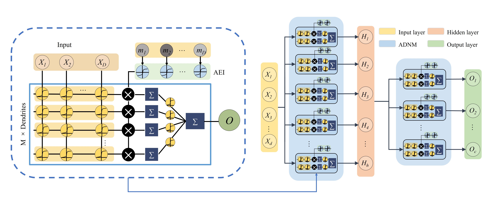

# ADNS

> ADNS: Alternating Excitation-Inhibition Dendritic Computing for Classification 

> Jiayi Li, Zhenyu Lei, Zhiming Zhang, Haotian Li, Yuki Todo, [Shangce Gao](https://toyamaailab.github.io/)

ADNS is a novel neural network architecture that emulates the excitation and inhibition mechanisms found in biological neurons. 

## Overview


ADNS enhancement enhances the feature extraction and nonlinear computation capabilities of single neurons, allowing the construction of multi-layer networks and enabling deep dendritic neuron models. 

## Getting Started

### Training

```
python train.py -m "ADNS" -d "./Datasets/real_data/MAT\Breast_Cancer_Wisconsin_Diagnosis.mat" --hidden_size 32 --DNM_M 16 -n 10
```

### Get the training batch file
```
python get_train_sh.py -n "all" 
```

### Generate result table
```
python get_result.py
```
