# ADNS

> **ADNS**: Alternating Excitation–Inhibition Dendritic Computing for Classification  
> Jiayi Li, Zhenyu Lei, Zhiming Zhang, Haotian Li, Yuki Todo, [Shangce Gao](https://toyamaailab.github.io/)

ADNS is a novel neural network architecture that emulates alternating excitation and inhibition mechanisms found in biological neurons. It enhances feature extraction and nonlinear computation at the single-neuron level, enabling the construction of deep, multi-layer networks.

---

## Table of Contents

- [Overview](#overview)  
- [Background](#background)  
- [Method](#method)  
  - [3.1 ADNM Model](#31-adnm-model)  
  - [3.2 AEI Mechanism](#32-aei-mechanism)  
  - [3.3 ADNS Architecture](#33-adns-architecture)  
- [Experiments & Results](#experiments--results)  
- [Quick Start](#quick-start)  
- [Citation](#citation)

---

## Overview


In neuroscience, inhibition is critical for regulating information flow, maintaining circuit stability, and supporting cognitive functions such as learning and attention. Dendritic inhibition modulates excitatory inputs directly at the dendrite, enhancing computational and representational capacity. While spiking neural networks have begun incorporating both excitatory and inhibitory synapses, most artificial neural networks still use simplified McCulloch–Pitts neurons, lacking any dendritic inhibition.

We address this gap by introducing the **Alternating Excitation–Inhibition Dendritic Neuron Model (ADNM)**, which integrates alternating excitation and inhibition signals via a learnable tanh-based mechanism and replaces the original multiplicative dendritic integration with additive operations. Building on ADNM, we propose the **Alternating Dendritic Neuron System (ADNS)**—a deep, multi-layer network composed of ADNM units. Extensive experiments on synthetic, real-world, and image datasets demonstrate superior classification performance and efficiency.

---

## Background

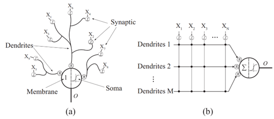

Existing Dendritic Neuron Models (DNMs) suffer from two key limitations: they use multiplicative integration, hindering multi-layer extensions, and they ignore dendritic inhibition, limiting expressiveness.

---

## Method

### 3.1 ADNM Model
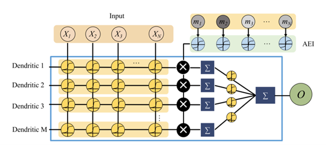

ADNM redefines the dendritic computation by replacing multiplicative integration with additive integration weighted by AEI:

- **Synapse Layer:**  
  $$
    S_{ij} = \sigma(w_{ij} x_i - q_{ij})
  $$
- **Dendrite Layer:**  
  $$
    D_{j} = \sum_{i=1}^{N} S_{ij} \cdot \tanh(m_i)
  $$
- **Soma Layer:**  
  $$
    O = \sum_{j=1}^{M} \sigma(k_j D_j - \theta_j)
  $$

### 3.2 AEI Mechanism

The **Alternating Excitation–Inhibition (AEI)** mechanism uses learnable weights $m_i$ passed through tanh to produce positive (excitatory) or negative (inhibitory) contributions, greatly enhancing nonlinear processing and classification accuracy.

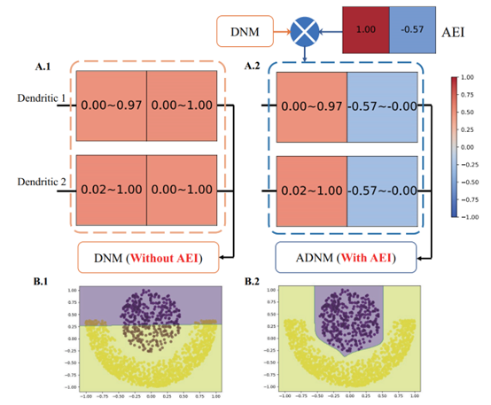

### 3.3 ADNS Architecture

Stacking multiple ADNM units yields **ADNS**, a deep neural system capable of learning complex decision boundaries. In this repository, we demonstrate a two-layer ADNS instance to validate scalability and performance.

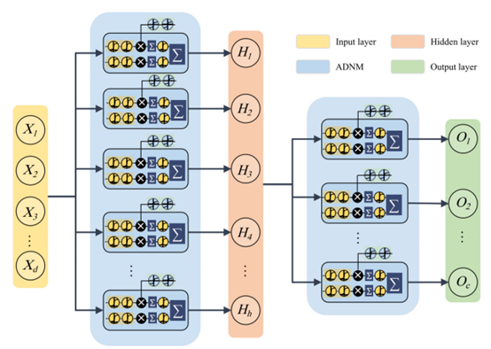

---

## Experiments & Results

We evaluate ADNS on:

- **47 feature classification datasets** (synthetic, small/medium/large scale)  
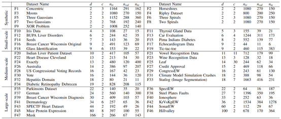
- **CIFAR-10** and **CIFAR-100** image classification  

Key findings:

- **Accuracy**: The experimental results are shown in the following table, which shows that ADNS performs better in various datasets compared to the existing deep learning models.
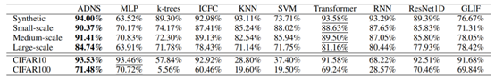
- **Decision Boundaries**: We plotted the decision boundaries of each model on the synthetic dataset Three Spirals, as shown in Fig. The decision boundaries derived from ADNS are accurate and smooth, and can categorize different types of data well.
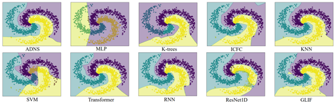
- **Efficiency**: ADNS also performs well in terms of computational efficiency, and we draw bubble plots to show the performance and efficiency of all models on the Tic-tac-toe dataset. It can be seen that ADNS has the fastest training speed and the highest classification accuracy, and the number of covariates of the model is much smaller than that of the Transformer model.
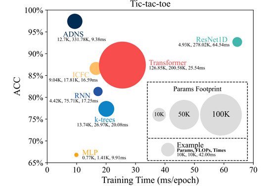
- **Scalability**: In deep learning, better performance can often be achieved by increasing the parameters of a model, but after a certain amount of parameter increase in the model, the performance does not improve. We analyzed the effect of increasing the number of parameters on different models on the Climate Model Simulation Crashes dataset, as shown in the figure below. From the figure, it can be seen that ADNS model can also improve the performance by increasing the number of parameters, while the other comparison models can not get better performance than ADNS even by increasing the number of parameters.
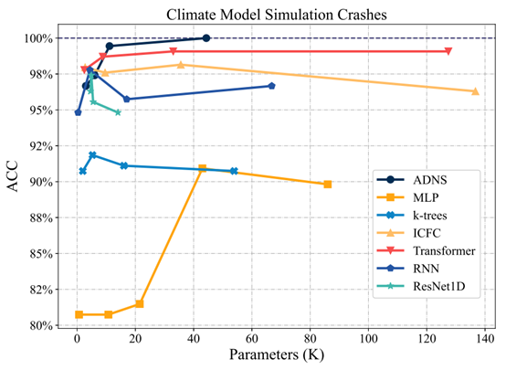
---


## Quick Start

### Dependencies

- Python 3.10  
- PyTorch ≥ 2.1  
- (Optional) CUDA & CuDNN for GPU acceleration

### Training Example

```
python train.py -m "ADNS" -d "./Datasets/real_data/MAT\Breast_Cancer_Wisconsin_Diagnosis.mat" --hidden_size 32 --DNM_M 16 -n 10
```

### Hyperparameter Setting

- **--hidden_size**: In our experiments, the hyperparameter **--hidden_size** is set to 32 for best results.
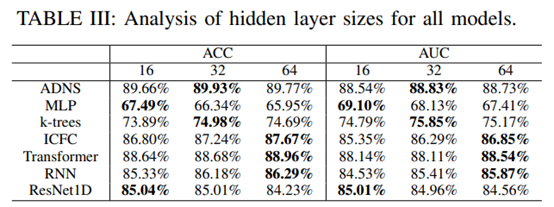

- **--DNM_M**: In our experiments, the hyperparameter **--DNM_M** is set to 16 for best results.
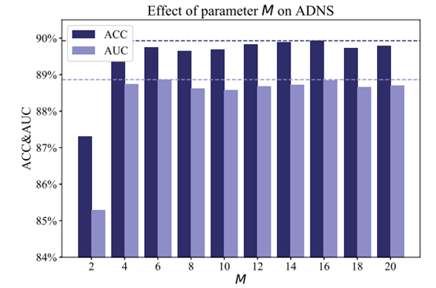

### Get the training batch file
```
python get_train_sh.py -n "all" 
```

### Generate result table
```
python get_result.py
```

## Citation
```bib
@article{li2024alternating,
  title={Alternating Excitation-Inhibition Dendritic Computing for Classification},
  author={Li, Jiayi and Lei, Zhenyu and Zhang, Zhiming and Li, Haotian and Todo, Yuki and Gao, Shangce},
  journal={IEEE Transactions on Artificial Intelligence},
  year={2024},
  volume={5},
  number={11},
  pages={5431-5441},
  publisher={IEEE Computer Society}
}
